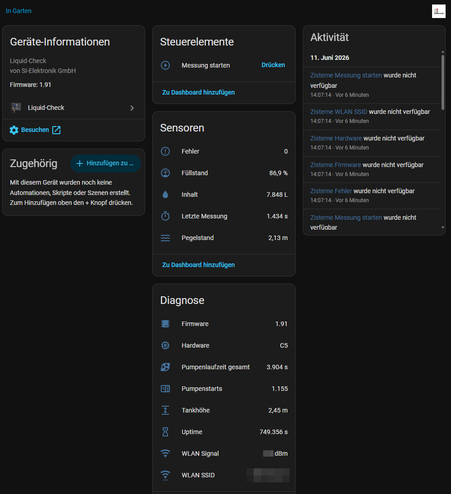

# Liquid-Check for Home Assistant

[](https://github.com/hacs/integration)


Home Assistant custom integration for **Liquid-Check** by SI-Elektronik.

Liquid-Check is a water level meter for cisterns. For device details, visit:
https://liquid-check-info.si-elektronik.de/

<p align="center">
	
</p>

[](https://github.com/custom-components/hacs)

## Highlights

- Native Home Assistant integration (Config Flow)
- Configurable polling interval
- Multiple sensor entities for measurement and diagnostics
- Service to trigger a new measurement
- Button entity to trigger a measurement directly in the UI
- Translation-ready entity names (e.g. German/English)

## Installation

Version 2.x requires Home Assistant 2025.6.0 or newer.

### Option 1: HACS (recommended)

1. Open **HACS** in Home Assistant.
2. Click **Explore & Download Repositories**.
3. Search for **Liquid-Check**.
4. Download and restart Home Assistant.

If the repository is not listed in your HACS setup, add:

`https://github.com/shivan/homeassistant-liquidcheck` as **Integration** custom repository.

### Option 2: Manual

Copy this repository's integration folder to:

`<config>/custom_components/liquid_check/`

Then restart Home Assistant.

## Upgrade

Upgrade from 1.x to 2.x may require re-installation due to major structural changes.
If entities/devices do not migrate cleanly, remove and re-add the integration.

## Configuration

Set up the integration via **Settings → Devices & Services → Add Integration**.

During setup, you can configure:

- Host/IP of your Liquid-Check device
- Polling interval (`scan_interval`, seconds)

After setup, you can change Host/IP and polling interval anytime via:

**Settings → Devices & Services → Liquid-Check → Configure**

## Example device view



Note: the example screenshot currently uses German labels in the Home Assistant UI.

## Entities

The integration provides sensors such as:

- Level (%)
- Content (L)
- Water level (m)
- Last measurement (duration)
- Error
- Firmware / hardware
- Tank max level
- System uptime
- Pump total runs / total runtime
- Wi-Fi RSSI / SSID

Some values are marked as diagnostic entities.

## Trigger a new measurement

### Service

Service: `liquid_check.start_measure`

- Without `entry_id`: triggers all configured Liquid-Check devices
- With `entry_id`: triggers only one configured device
- After triggering, values are refreshed automatically after ~10 seconds

Example:

```yaml
action:
	- service: liquid_check.start_measure
		data:
			entry_id: "01J..."
```

### Button entity

A button entity is created per device to start a measurement directly from the UI.
After pressing the button, the integration waits ~10 seconds and then refreshes values.

## Compatibility notes

- `LEGACY_SENSOR_NAMES` from older implementations was intentionally **not** reintroduced.
- The integration now uses translation keys and stable key-based entity naming for cleaner localization and long-term maintainability.

## Which file is responsible for what?

- `custom_components/liquid_check/__init__.py`
	- integration setup/unload
	- service registration (`liquid_check.start_measure`)
	- delayed refresh after measurement trigger
- `custom_components/liquid_check/button.py`
	- button entity (`start_measure`)
	- delayed refresh after button press
- `custom_components/liquid_check/sensor.py`
	- sensor entities and value mapping
- `custom_components/liquid_check/const.py`
	- constants, platform list, sensor definitions
- `custom_components/liquid_check/translations/*.json`
	- UI translations for entity names (DE/EN)
- `custom_components/liquid_check/manifest.json`
	- integration metadata (`version`, required Home Assistant version)

## Additional documentation

See [info.md](info.md) for an integration-focused summary.
